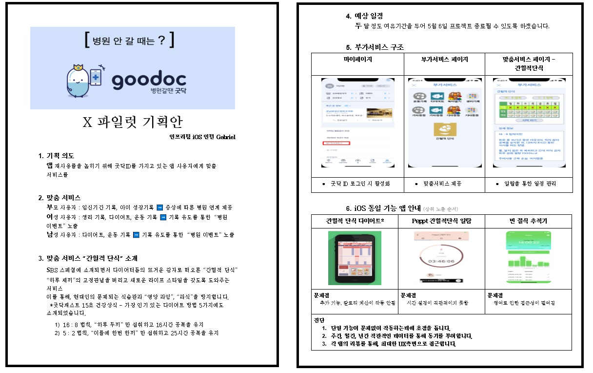

# X-Pilot 간헐적단식

2019/03/11 ~ 2019/05/17 - X-Pilot 간헐적단식

### 업무 요구 사항 : 실제 업무에 도움이 되는 사이드 프로젝트를 제안

#### 기획 

앱 재사용율을 높히기 위해 굿닥 ID를 가지고 있는 앱 사용자에게 맞춤 서비스를 제공하자

#### 주제 : 간헐적 단식

프로토타입

---

#### 팀 역할 분배

  김양우 

    - 기획, 
    
    - 앱 레이아웃 구성 : MAPKIT, Core Location, 

  이규현 

    - XML 파싱
    
    - 파싱 데이터를 뷰에 뿌림

#### 최종 결과물 소개

#### 기획 대비 완성률 및 개발 과정에서 초기 기획과 달라진 점

      - 기획 대로 됨
    
      - 한 기능에 포커스를 둠

#### 해커톤을 하면서 새로 알게된 점 + 다른 팀도 이런 점을 알았으면 좋겠다 하는 부분

      - 역활 배분
    
      - 처음부터 큰 규모가 아닌 작은 부분부터 해나가면서 진행해야함.
    
        - 핵심 기능을 해결한 후 부가적인 기능을 해결해야함
    
        - 해결 후, 추가적인 기능이나, 디자인에 집중해도 됨.

#### 가장 어려웠던 부분

      - 처음 써보는 기술을 이용하여 기능을 구현할 때,
    
        - 처음 쓰는 기술이 핵심 기능일 경우, 프로젝트가 폭망하는🤮 이슈
    
      - 시간적 제약
    
      - 외부 자료를 이해해서 사용하는 부분
    
      - 기능 적용 시, 생각한대로 나오지 않는 부분

#### 가장 아쉬웠던 부분 + 다시 해커톤을 하게 된다면 이런 식으로 하고 싶다.

      - 디자인
      
        - 아이콘, 상황맞는 이미지들의 리소스가 많이 있으면 좋겠다.
        
      - 추가 기능
      
        - 약국 API JSON 처리
        
          - 시간적 제약 때문에 해결 못함, 
          
          - JSON, CSV, XML등의 자료들을 처리하는 능력을 길러야겠다.

#### 프로젝트 때는 어떤 식으로 적용할 것인지

      - 인터넷이 원활한 장소를 섭외해야함.
      
      - 기획에서 확실한 기능 정의가 필요함.
      
      - 디자이너가 있었으면 좋겠다.
      
        - 또는 기본적인 디자인 소양이 필요할거 같다.
